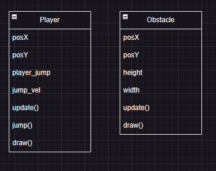
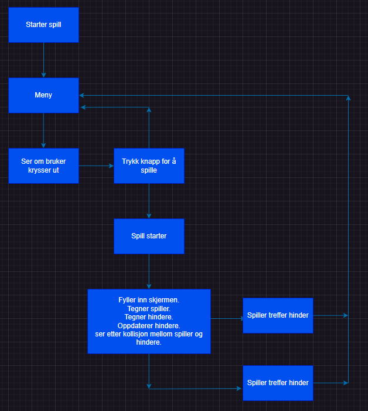

# Modellering og representasjon

## Objektorienterte modeller som beskriver programstruktur

## Representasjon av programflyt med kontrollstrukturer

## Brukervennlighet i programmer
Brukervennlighet refererer til hvor lett det er for brukere å interagere med et program eller en applikasjon. Et brukervennlig program er designet på en slik måte at det er intuitivt, enkelt å navigere og krever minimal innsats for å oppnå ønsket oppgave. Det tar hensyn til brukerens behov, ferdigheter og opplevelse for å skape en positiv og effektiv brukeropplevelse. Et brukervennlig program gir tydelig og konsistent tilbakemelding, har en oversiktlig brukergrensesnitt, og tilbyr veiledning og hjelpemidler for å hjelpe brukeren med å oppnå sine mål.
